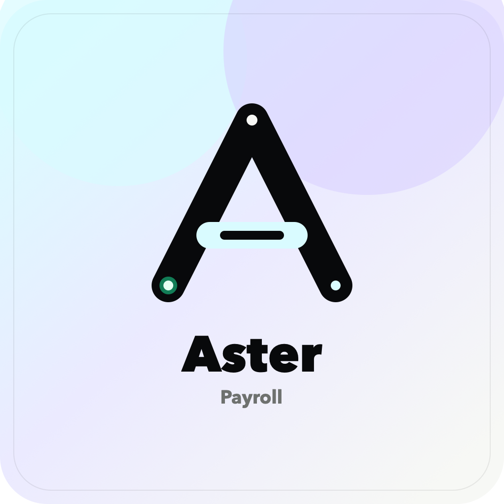
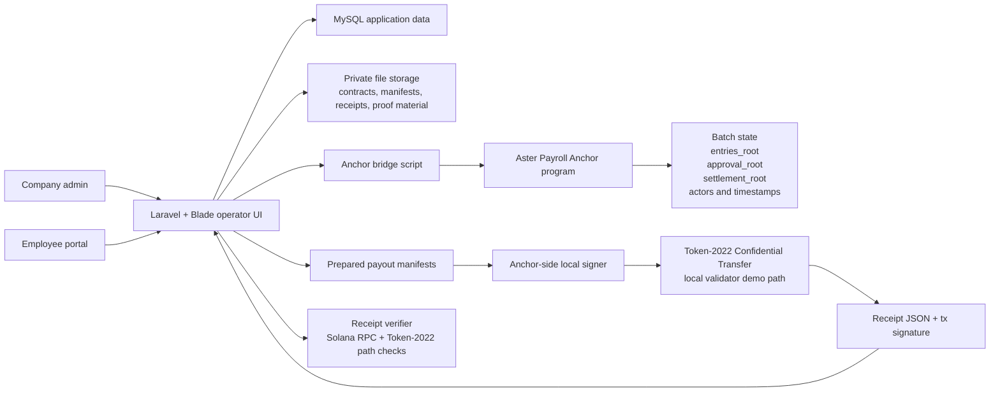

# Aster Payroll



Aster Payroll is a private, verifiable payroll settlement system on Solana.

It lets a company commit payroll batches onchain, approve the exact payout manifest set, execute a Token-2022 confidential-transfer settlement path in the demo environment, and import verified receipts back into an operator UI without publishing plaintext salaries onchain.

## Why This Exists

Payroll needs privacy and proof at the same time.

Normal onchain payroll payments expose the sender, recipient, timing, and amount. That is not acceptable for salary settlement. Traditional payroll systems solve privacy by keeping everything in a private database, but then employees and reviewers must trust the operator's internal ledger.

Aster Payroll splits those responsibilities:

- Laravel handles the product UI, employee records, documents, payroll drafting, private proof material, receipt import, and employee self-service views.
- Solana handles the payroll batch lifecycle, proof roots, actor references, and chain-derived timestamps.
- Token-2022 Confidential Transfer provides the private payout path for the current demo.

The result is a payroll flow where settlement can be traced from a local payroll row to Solana accounts, transaction signatures, and committed roots, while compensation amounts stay off the public chain.

## Current Demo Status

This repository contains a working local demo, not a production custody protocol.

Current onchain program:

- Program ID: `4SZ4Fdt4pYurKjtdfEkHvRm9zZ2uTnHmdkGFrQxp1EhE`
- Cluster in `onchain/Anchor.toml`: `localnet`
- Demo validator: Dockerized local validator with Token-2022 and the Aster Payroll program preloaded

The confidential settlement path currently depends on the local validator helper because the demo needs Token-2022 confidential-transfer support. A devnet deployment can be added for the non-confidential batch lifecycle, but this README does not claim a devnet deployment until one is committed and linked.

## What The Demo Shows

Company admin flow:

- Create or seed employees under a single demo company.
- Store contract PDFs privately and anchor contract hashes.
- Record compensation amendments with privacy-safe onchain references.
- Draft a payroll batch from effective compensation records.
- Commit `entries_root` onchain.
- Prepare one payout manifest per payroll entry.
- Approve the manifest set and commit `approval_root` onchain.
- Run the Anchor-side local signer outside Laravel.
- Import Token-2022 confidential-transfer receipts.
- Derive `settlement_root` and finalize the payroll batch onchain.

Employee flow:

- Log in through the employee portal.
- View only the authenticated employee's own contract summary and payroll history.
- View that employee's own proof metadata, entry leaf, amount commitment, batch roots, and transaction references.
- Avoid exposure to other employees' salaries, receipts, proof leaves, or payroll entries.

## Architecture



## Onchain Program Surface

The Anchor program in `onchain/programs/aster_payroll/src/lib.rs` exposes six core instructions:

- `initialize_company`
- `create_employment_contract`
- `amend_compensation`
- `commit_payroll_batch`
- `approve_payroll_batch`
- `finalize_payroll_batch`

The payroll batch lifecycle is:

```text
COMMITTED -> APPROVED -> FINALIZED
```

The program stores:

- company authority and treasury wallet references
- employment contract hashes and current compensation references
- compensation amendment hashes
- payroll period metadata and entry count
- `entries_root`
- `approval_root`
- `settlement_root`
- approver and finalizer public keys
- chain-derived approval and finalization timestamps

It does not store plaintext salaries, raw contract documents, raw receipts, or per-employee salary mappings.

## Repository Layout

```text
backend/   Laravel app, Blade UI, models, controllers, services, migrations, feature tests
onchain/   Anchor program, TypeScript tests, local signer, payroll attestation scripts
scripts/   Local validator and Token-2022 helper scripts
```

## Quick Start

The project is designed to run inside the existing devcontainer. The default backend environment expects MySQL at hostname `mysql`.

Start the full local demo environment:

```bash
./scripts/start-demo-env.sh
```

Stop it without removing the validator container:

```bash
./scripts/stop-demo-env.sh
```

### Backend

```bash
cd backend
composer install
cp .env.example .env
php artisan key:generate
php artisan migrate --force
php artisan db:seed --force
npm install --ignore-scripts
npm run build
```

Open:

```text
http://localhost:8000
```

Seeded demo accounts:

- Admin: `admin@aster.test` / `password`
- Paid employee: `alice.payroll.demo@aster.test` / `password`

### Onchain

```bash
cd onchain
yarn install
yarn lint
NO_DNA=1 anchor test
```

### Confidential Validator

Build the Anchor program first if needed:

```bash
cd onchain
anchor build
```

Then start the local Token-2022 confidential-transfer validator from the repository root:

```bash
./scripts/start-confidential-validator.sh
```

The helper exposes:

- host RPC: `http://127.0.0.1:8899`
- host WebSocket: `ws://127.0.0.1:8900`
- app-container RPC: `http://aster-payroll-confidential-validator:8899`

Before running the payroll demo, check the environment from `backend/`:

```bash
php artisan payroll:demo-health
```

## Demo Walkthrough

1. Start the Laravel app and confidential validator.
2. Log in as `admin@aster.test`.
3. Confirm seeded employees, contracts, and compensation records.
4. Draft a payroll batch.
5. Prepare payout manifests in the Confidential Payroll Demo page.
6. Run the signer once per manifest:

```bash
cd onchain
ASTER_PAYOUT_MANIFEST=/abs/path/to/payout-execution-manifest.json \
ASTER_COMPANY_OWNER_KEYPAIR=/abs/path/to/admin-company-wallet.json \
yarn signer
```

7. Import each generated receipt JSON into Laravel.
8. Confirm the payroll batch shows commit, approval, and finalization references.
9. Log in as `alice.payroll.demo@aster.test` and show that the employee sees only her own payroll proof metadata.

## Verification

Backend tests:

```bash
cd backend
composer test
```

Onchain tests:

```bash
cd onchain
NO_DNA=1 anchor test
```

Demo health check:

```bash
cd backend
php artisan payroll:demo-health
```

## Current Limitations

- The confidential transfer demo is local-validator based.
- Browser-wallet payout approval is not implemented in this pass.
- The current demo is single-company and single-currency (`USDC`, 2 minor units).
- Laravel prepares manifests and stores private proof material; the approving signer remains outside Laravel.
- The program does not yet implement program-controlled payroll vaults, PDA-gated fund release, refund paths, slashing, or onchain per-entry payout execution.
- Per-entry proof material remains offchain in Laravel for this demo. Solana stores batch-level roots and state transitions.

## Roadmap

The next product step is a separately specified custody model:

- program-controlled payroll vaults
- PDA-gated payout authorization
- refund and failure paths
- stricter public verifier UX
- optional per-entry onchain accounts where they improve external verification

That work needs a separate spec and threat model before implementation.

## License

MIT. See `LICENSE`.
